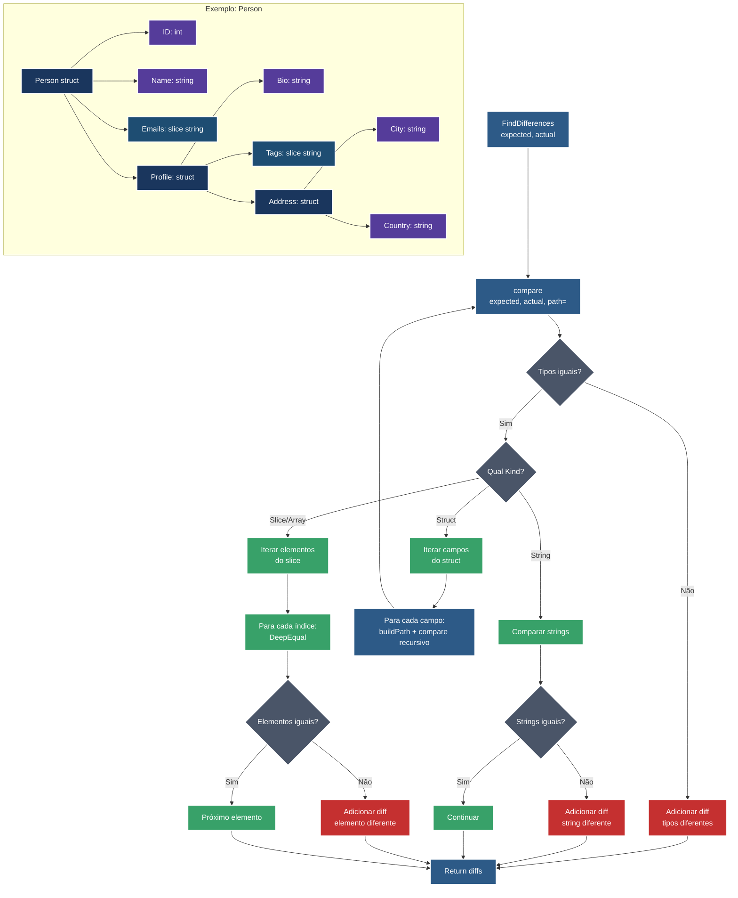

# Go Struct Diff Analyzer

Este projeto implementa um comparador de structs em Go que identifica diferenças entre objetos complexos.

## Fluxo da Função FindDifferences



## Tipos de Dados Suportados

- ✅ **Struct**: Comparação recursiva de campos
- ✅ **String**: Comparação direta de valores
- ✅ **Int**: Comparação de números inteiros
- ✅ **Slice/Array**: Comparação elemento por elemento
- ✅ **Bool**: Comparação de valores booleanos
- ✅ **Float**: Comparação de números decimais
- ✅ **Ptr**: Suporte a ponteiros
- ✅ **Map**: Comparação de mapas

## Exemplo de Uso

```go
expected := Person{
    ID:     1,
    Name:   "Alice",
    Emails: []string{"alice@company.com", "alice@personal.com"},
    Profile: Profile{
        Bio:  "Engineer",
        Tags: []string{"go", "backend", "api"},
        Address: Address{
            City:    "São Paulo",
            Country: "Brasil",
        },
    },
}

actual := Person{
    ID:     1,
    Name:   "Alice",
    Emails: []string{"alice@company.com", "alice@gmail.com"},
    Profile: Profile{
        Bio:  "Developer",
        Tags: []string{"go", "frontend", "api"},
        Address: Address{
            City:    "São Paulo",
            Country: "Brazil",
        },
    },
}

diffs := FindDifferences(expected, actual)
```

## Saída Esperada

```
Field differences:
  └─ Emails: "alice@personal.com" ≠ "alice@gmail.com"
  └─ Profile.Bio: "Engineer" ≠ "Developer"
  └─ Profile.Tags: "backend" ≠ "frontend"
  └─ Profile.Address.Country: "Brasil" ≠ "Brazil"
```
