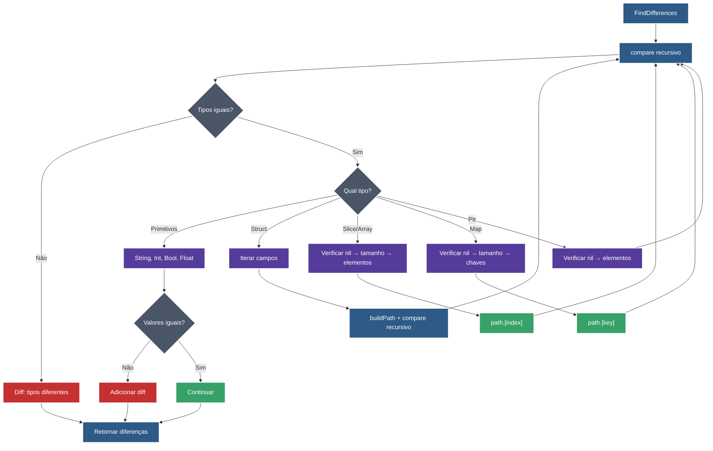

# Go Struct Diff Analyzer

Este projeto implementa um comparador de structs em Go que identifica diferenças entre objetos complexos.

## Fluxo da Função FindDifferences



## Tipos de Dados Suportados

### Tipos Primitivos

- **String**: Comparação direta de valores
- **Bool**: Comparação de valores booleanos
- **Int/Int8/Int16/Int32/Int64**: Comparação de inteiros (preserva tipo original)
- **Uint/Uint8/Uint16/Uint32/Uint64**: Comparação de inteiros sem sinal
- **Float32/Float64**: Comparação de números decimais

### Tipos Compostos

- **Struct**: Comparação recursiva de campos
- **Slice/Array**: Comparação elemento por elemento com detecção de tamanho
- **Map**: Comparação chave-valor com suporte a chaves ausentes
- **Ptr**: Suporte a ponteiros com detecção nil vs não-nil

## Funcionalidades Avançadas

### Paths Específicos

- **Campos simples**: `Name`, `Age`
- **Structs aninhados**: `Profile.Bio`, `Profile.Address.City`
- **Elementos de slice**: `Emails.[0]`, `Tags.[1]`
- **Valores de map**: `StringMap.[key1]`, `PersonMap.[employee1].Name`
- **Maps aninhados**: `NestedMap.[group1].[item1]`

### Detecção Inteligente

- **Nil vs Empty**: Diferencia `nil` de slices/maps vazios
- **Tipos preservados**: Mantém `int` vs `int32` vs `int64`
- **Tamanhos diferentes**: Detecta slices/maps com tamanhos diferentes
- **Chaves ausentes**: Identifica chaves faltando em maps

## Exemplo de Uso Completo

```go
// Comparação de slice de structs
expectedItems := []Item{
    {ID: 1, Status: "active", Value: 100},
    {ID: 3, Status: "active", Value: 150},
    {ID: 5, Status: "active", Value: 300},
}

actualItems := []Item{
    {ID: 1, Status: "active", Value: 100},
    {ID: 3, Status: "active", Value: 140}, // Changed
    {ID: 5, Status: "active", Value: 250}, // Changed
}

diffs := FindDifferences(expectedItems, actualItems)
```

## Saída Esperada

```
Direct Slice Comparison:
  Found 2 difference(s):
  └─ [1].Value: 150 ≠ 140
  └─ [2].Value: 300 ≠ 250
```
